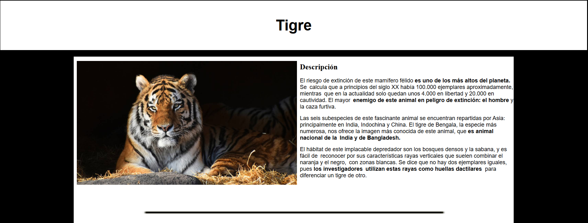
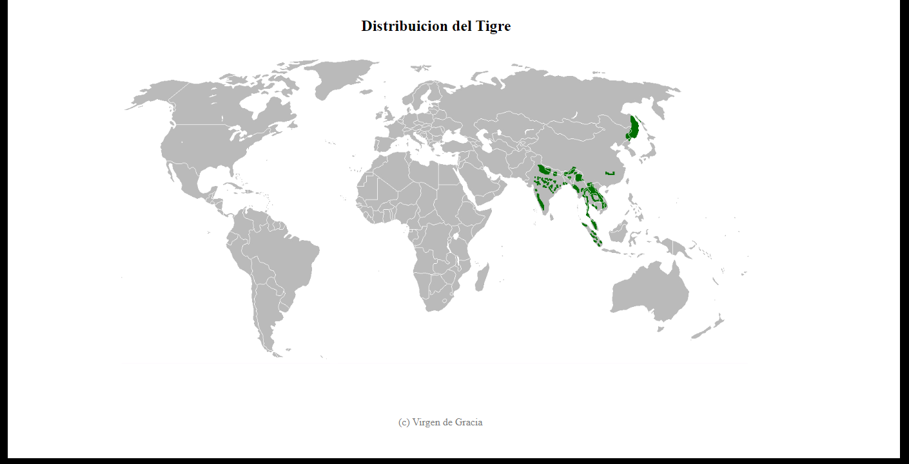

# Mi pagina web 'Tigre'
Indice  
- [Primera Parte](##Primera-Parte)
- [Segunda Parte](##Segunda-Parte)
- [Tercera Parte](##Tercera-Parte)
## Primera Parte
  
Esto es una parte de varias paginas web dedicadas a los animales en este caso es sobre el tigre. A continuacion voy a explicar las diferentes cosas que se pueden llegar a visualizar:
- La pagia se sume en blancos y negros para crear ese contraste minimalista, pero al gusto de la vista.
- Un header con el titulo ***Tigre*** en negro sobre un fondo en blanco para hacer contraste.
- Un texto informativo acompañado de una imagen del animal del cual se habla y una breve descripcion de el y su situaacion actual.
> Abajo hay una pequeña linea negra que separa este contenido del siguiente.

## Segunda Parte
  
En esta parte de la pagina divido en tres secciones las diferentes noticias del animal, hablo de noticias actuales sobre enfermedades de las que se contagian, natalidad, entre otras. 
- Tres fotos con sus respectivos titulos abajo.
- Descriopcion de las noticias.
- 

## Tercera Parte
  
Esta es la parte final de la pagina, la cual se compone de un mapa geografico donde esta señalada la ubicacion del tigre y como esta distribuido.
> Abajo se encuentra el sello de *copyright*

